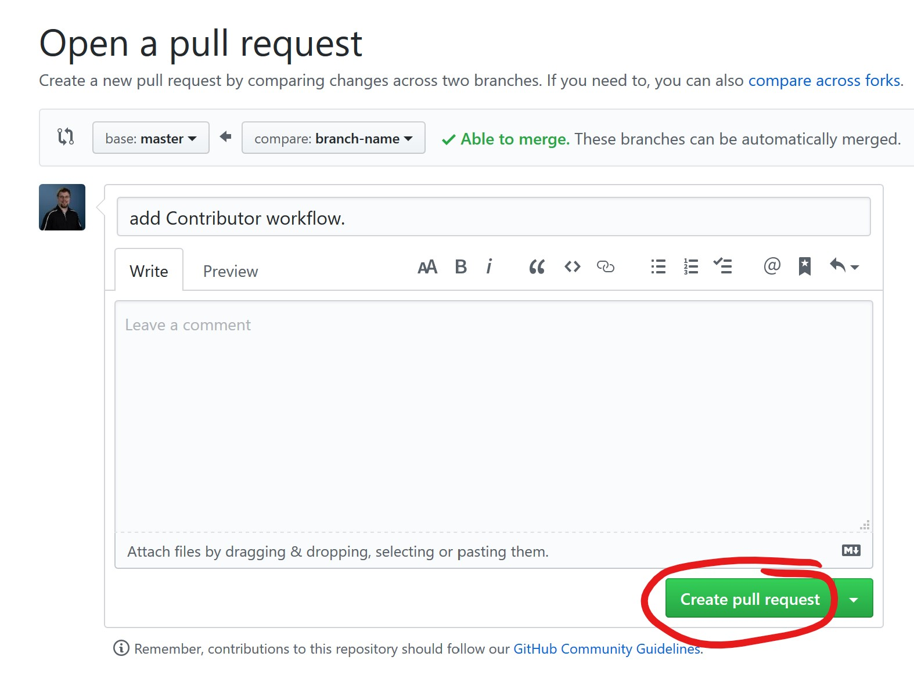
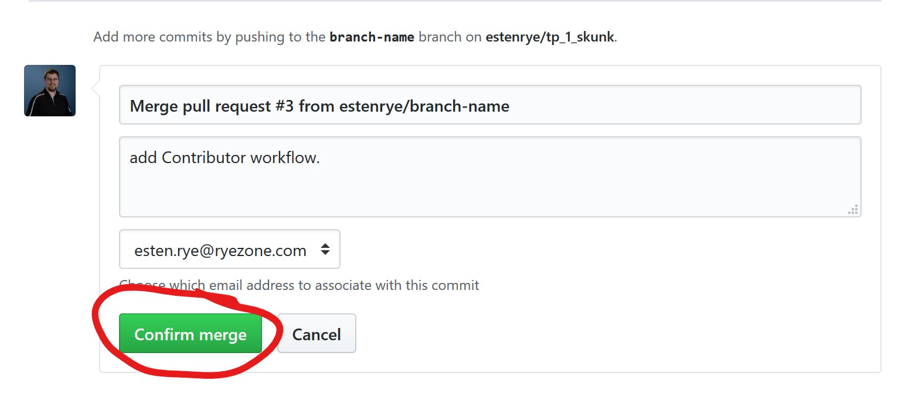

# seis635-tp1
Team project one for SEIS 635

Collaborators:

- Esten Rye
- Jie Li

# Contributor Workflow.

Start from the master branch and pull latest from origin.

```bash
git checkout master
git pull
```

Next create a new branch.

```bash
git checkout -b 'my-new-branch-name'
```

On your initial push to origin, you will need to set your upstream branch.  If you do a `git push` Git will remind you of this.

```bash
git push --set-upstream origin 'my-new-branch-name'
```

After this point you can push changes to the remote repository using the following commands:

```bash
git add *
git commit -m 'your commit message'
git push
```

Every time you push, GitHub will run the CI workflow and validate your code builds and the unit tests pass.

When you are ready to merge to master, you will need to open a pull request in GitHub.

# Integrating Recent Changes from Master into your Local branch.

To pull down the latest changes from master:

```bash
git fetch orgin master
```

To integrate the latest changes into your branch run this command:

```bash
git merge FETCH_HEAD
```

If you have conflicts with master, Git will tell you when you merge locally.  This will give you an opportunity to resolve the merge conflict before you push to your remote branch.

# Opening a Pull Request

This is the first step to integrating your changes into `master`.  When you push your changes to your remote branch in GitHub, this button will usually appear on the main repository page.


Click the `Create a pull request` button.

You will be taken to a new UI shown below:



Add any comments you feel describe the changes you have made then click `Create pull request`.

Once you have done this the automated CI checks will execute on the PR.  If all checks pass, you will be able to merge the pull request.


You will be asked to confirm the Merge.  At this point in time you can add any comments you would like to have in the merge commit for the commit log.  Click `Confirm Merge` to complete the Pull Request.



Once the merge has completed, delete your remote branch.  This does not delete the local branch from your machine


If you would like to delete your local branch after deleting the remote branch, run this command:

```bash
git branch -d 'branch-name'
```

## Finite State Diagram

